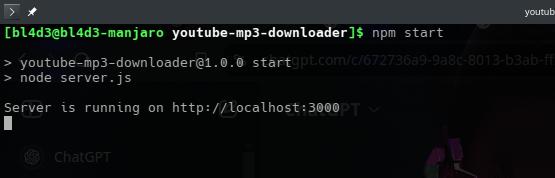
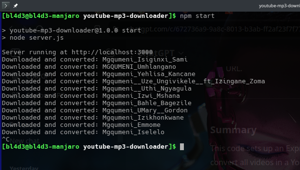

# YouTube Playlist MP3 Downloader

This Node.js application downloads an entire YouTube playlist as individual MP3 files, converting each video to MP3 format using `ffmpeg`.

## Features

- Download all videos from a YouTube playlist in MP3 format.
- Convert each video to a 128kbps MP3 file.
- Store files in a designated "downloads" directory.

## Requirements

- Node.js (version 14 or higher recommended)
- An internet connection
- FFMPEG installed (handled automatically via `ffmpeg-static`)

## Installation

1. Clone the repository or download the project files.
2. Navigate to the project directory and install the dependencies:

   ```bash
   npm install
   ```
## Usage

1. Start the server:

    ```bash
    npm start
    ```

    


2. Access the downloader by visiting:

    ```bash
    http://localhost:3000/download-album?url=<Playlist_URL>
    ```
Replace <Playlist_URL> with the actual URL of the YouTube playlist you wish to download.

3. The MP3 files will be saved in the `downloads` directory within the project folder.   

## Project Structure

| Path                   | Description                            |
|------------------------|----------------------------------------|
| `youtube-mp3-downloader/` | Project root folder                  |
| ├── `server.js`         | Main server file                       |
| ├── `package.json`     | npm dependencies and scripts           |
| └── `README.md`        | Project description and instructions   |

## Dependencies

- `express`: Web framework for handling HTTP requests.
- `youtube-dl-exec`: For downloading YouTube videos.
- `play-dl`: For managing YouTube playlists.
- `fluent-ffmpeg`: For converting media to MP3 format.
- `ffmpeg-static`: Supplies a cross-platform ffmpeg binary.

## Example Request

To download an entire playlist, visit:

    ```bash
    http://localhost:3000/download-album?url=https://www.youtube.com/playlist?list=YOUR_PLAYLIST_ID
    ```


## Notes

- Make sure to only download content you have permission to use.
- Large playlists or high-quality settings may take some time to process.
- Ensure you use a Playlist_URL that points to an album of tracks, not a Playlist_URL that links to a single track.


## License

This project is licensed under the Unlicensed.
